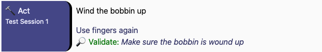
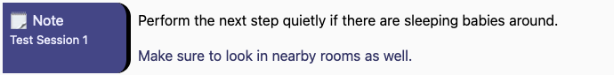
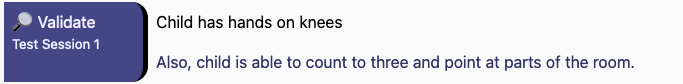

= Manual Action Library
_Provengo Core Team_

A library for defining manual actions and validations. Useful for generating https://docs.provengo.tech/ProvengoCli/0.9.5/subcommands/gen-book.html[manual test books], but can also be used as a placeholder actuation layer before another automation layer is implemented.

This library supports actions, validations, and notes. There is also support for generating test books steps (for HTML and Excel formats), and common event sets.

TIP: To see an example of this library in action, look at the link:wind-bobbin-up[] directory, which contains a Provengo project with manual instructions for https://en.wikipedia.org/wiki/Wind_the_Bobbin_Up[a famous nursery rhyme].

== Installation

To install, place the library's source file, xref:wind-bobbin-up/lib/ManualLib.js[], in the `lib` folder of your project. To download directly from this site, write the following snippet at your project's root directory:

[source, bash]
----
TODO: Correct this
curl https://raw.githubusercontent.com/Provengo/Lib-LuT/main/lib/lut.js > lib/ManualLib.js
----

== Library Reference

=== Static Methods

==== `Manual.defineUser(sessionName)`

Creates a new manual session object, with the given name. See session object reference below.

==== `Manual.any`
An event set that contains all events from this library, from all sessions. For example, to wait for any of the Manual library events, use `waitFor(Manual.any)`.

==== `Manual.addTestBookStep(event, format)`
Adds a test book step for Manual library events, and ignores other events. Returns `true` if a manual step was added to the current book.

Parameters:

`event`:
    The event that may or may not be a Manual library event. 
`format`:
    Optional. Either "html" (default), or "qc-xls". The former generates a step with richer markup, whereas the latter creates a plain-text step description.

Returns: `true` if a step was added to the test book, and `false` otherwise.

=== `UserSession`

A `UserSession` object describes a single user session during a manual test. To create a new object of this type, call `Manual.defineUser(name)` and pass the user session name (e.g. "customer", "admin").

[NOTE]
====
This library defines three step types: `Action`, `Validation`, and `Note`. Each step type has two methods associated with it: one for performing it (i.e. `session.doX`) and one for referring to its event (i.e. `session.xEvent`).

The `session.doX` methods are really just convenience methods. The following two lines are equivalent:

[source, javascript]
----
request(session.actionEvent("do something")); // explicit form
session.doAct("do something"); // convenience shorthand
----
====

==== `session.doAct(action, details, validation)`

Request a `session.actionEvent(action, details, validation)`. See below.

==== `session.actionEvent(action, details, validation)`

An event telling the tester to take some action, for example to click a button or type some text. Can optionally contain details and validation.

Parameters:

`action`:
    String. The action that the tester should perform.
`details`:
    Optional, String. Any further details about `action` the tester needs to know.
`validation`:
    Optional, String. A validation step that needs to be done immediately after performing `action`.

.An action step shown in a HTML test book.

==== `session.doNote(text, details)`

Requests a `session.noteEvent(text, details)`. See below.

==== `session.noteEvent(text, details)`

An event informing the tester of something important, often some context about the action or some non-actionable information.

Parameters:

`text`:
    String. Main note text.
`details`:
    Optional, String. Additional details for the note.

.An note step shown in a HTML test book.

==== `session.doValidate(condition, details)`

Request a `session.validateEvent(condition, details)`. See below.

==== `session.validationEvent(condition, details)`

An event instructing the tester to validate a condition. Normally used to validate a condition that depends on multiple actions that precede the validation. In these cases, we'll see a series of ``actionEvent``s, followed by one or more ``validationEvent``s.

Parameters:

`condition`:
    String. The condition that should be validated.
`details`:
    Optional, String. Additional validation details, if needed.

.An validation step shown in a HTML test book.

==== `session.any`
An event set containing all events from `session`.

== Other Places in the Provengoverse

* https://docs.provengo.tech[The Provengo tool Documentation]
* https://www.youtube.com/@provengo[Provengo's YouTube Channel]
* https://provengo.tech[Provengo's Main Site]

---

Enjoy, and we hope you find it useful! Feel free to fork, improve, and share your version of this library!

-- Provengo Engineering